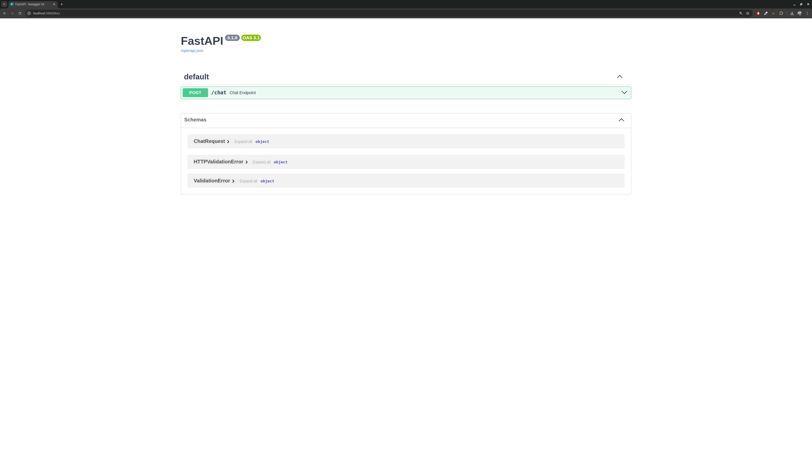

# Netflix Chat Bot 🎬🤖

A conversational assistant that helps users troubleshoot Netflix-related issues using AI-powered question matching and response generation. This project is split into two main components: a Python backend (FastAPI) and a React frontend.

## 📁 Project Structure

```
netflix-chat-bot/
├── netflix_agent_backend/    # FastAPI backend for AI logic and API endpoints
├── netflix_agent_front/      # React frontend interface
└── README.md                 # Project overview and setup instructions
```

## 🔧 Features

- Embedding-based similarity search using sentence-transformers
- Natural language responses via Gemini API
- FastAPI REST API for processing questions
- React-based frontend interface
- Clean and modular code for easy extension

## 🛠️ Technologies Used

| Layer     | Stack                                                      |
|-----------|------------------------------------------------------------|
| Backend   | Python, FastAPI, Uvicorn, Pydantic, SentenceTransformers   |
| AI Model  | `tall-MiniLM-L6-v2` (embedding model) + Gemini API        |
| Frontend  | React, Vite, Tailwind CSS                                  |

## 🚀 How to Run the Project

### Prerequisites

- Python 3.10+
- Node.js (v16 or higher)
- npm or yarn
- (Optional) virtualenv for Python

### ✅ Step 1: Run the Backend

1. Navigate to the backend folder:

   ```bash
   cd netflix_agent_backend
   ```

2. (Optional) Create and activate a virtual environment:

   ```bash
   python -m venv venv
   source venv/bin/activate  # or venv\Scripts\activate on Windows
   ```

3. Install dependencies:

   ```bash
   pip install -r requirements.txt
   ```

4. Run the backend server:

   ```bash
   uvicorn app:app --reload --host 0.0.0.0 --port 5000
   ```

Backend available at: [http://localhost:5000](http://localhost:5000)

### Once running, it will be possible to access the documentation through:


## Types of Support Questions You Can Ask

More information on how scrapping and processing works is found inside the netflix_agent_backend project.

This chatbot is designed to assist with a wide range of technical issues related to Netflix usage. Here are the main categories of problems users can receive help with:

- **Login and Account Access**
  - Can't sign in to your Netflix account?
  - Forgot your password or email address?
  - Issues with two-factor authentication or verification codes?

- **Playback and Streaming Issues**
  - Buffering, lagging, or poor video quality?
  - Content won't play or keeps crashing?
  - Audio out of sync or missing subtitles?

- **Device Compatibility**
  - Trouble using Netflix on Smart TVs, smartphones, or game consoles?
  - Installation problems on Android/iOS devices?

- **Subscription and Billing**
  - Questions about your current plan?
  - Billing issues or unauthorized charges?
  - How to change or cancel your subscription?

- **Content Availability**
  - Can't find a specific movie or show?
  - Understanding regional availability restrictions?

- **Parental Controls & Profiles**
  - Setting up or modifying child-safe profiles?
  - Troubleshooting profile switch issues?

- **General Usage Questions**
  - How to download content?
  - Tips on managing your watchlist or playback settings?

If your question is outside the chatbot’s scope, it will politely guide you to contact Netflix support directly.


### ✅ Step 2: Run the Frontend

1. Navigate to the frontend folder:

   ```bash
   cd netflix_agent_front
   ```

2. Install dependencies:

   ```bash
   npm install
   ```

3. Start the frontend:

   ```bash
   npm run dev
   ```

Frontend available at: [http://localhost:5173](http://localhost:5173)

## 🌐 API Endpoint

POST `http://localhost:5000/chat`

Request body:

```json
{
  "question": "How can I fix buffering issues on Netflix?"
}
```

## 📄 License

This project is released under the MIT License.